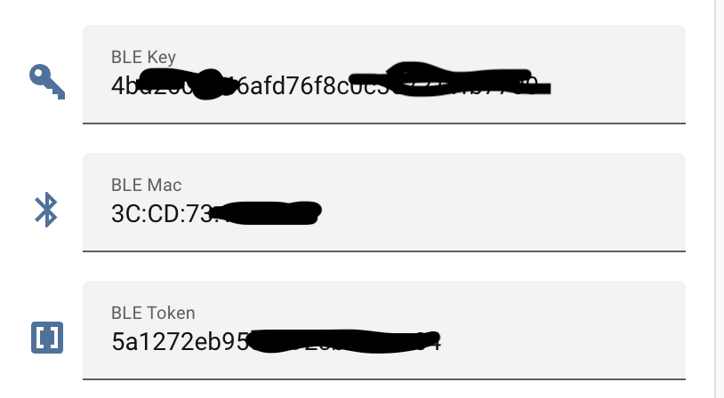

# CUKTECH 10 GaN Charger Ultra - ESPHome BLE Bridge

[](LICENSE)

ESPHome external component that turns an ESP32 into a Bluetooth bridge for CUKTECH 10 GaN Charger Ultra.


Porting from: https://github.com/kairui1108/cuktech-ble-ha

### 1. Install ESPHome

If you do not already run ESPHome, install the official add-on from the Home
Assistant add-on store. Open the ESPHome dashboard once so that the
configuration directory `/config/esphome/` exists.

### 2. Drop the YAML in place

Only one file is strictly required: `esp32s3-cuktech-ble.yaml`. Copy it into your
ESPHome configuration directory and rename it (e.g. `esp32s3-cuktech-ble.yaml`):

```
/config/esphome/
└── esp32s3-cuktech-ble.yaml
```

By default the YAML pulls the bridge component **directly from this GitHub
repository** on every compile via:

```yaml
external_components:
  - source: github://tsunglung/esphome-cuktech-ble@main
    components: [cuktech-ble]
```

That way the bridge updates in lockstep with the HA integration whenever you
recompile - no manual file copies, no version drift. Pin to a tag
(e.g. `@v1.10.0`) instead of `@main` if you want reproducible builds.

### 3. How to Use

Use [Xiaomi-cloud-tokens-extractor](https://github.com/PiotrMachowski/Xiaomi-cloud-tokens-extractor) to get the charger information from Xiaomi Cloud.
Then fill the BLE mac/token/key in the text of ESPHome then turn on the switch "Connection Controlling". If not work, try to reboot.



## Thanks

- Original：[kairui1108/cuktech-ble-ha](https://github.com/kairui1108/cuktech-ble-ha)
- CUKTECH / 酷态科 CUKTECH 10 GaN Charger Ultra